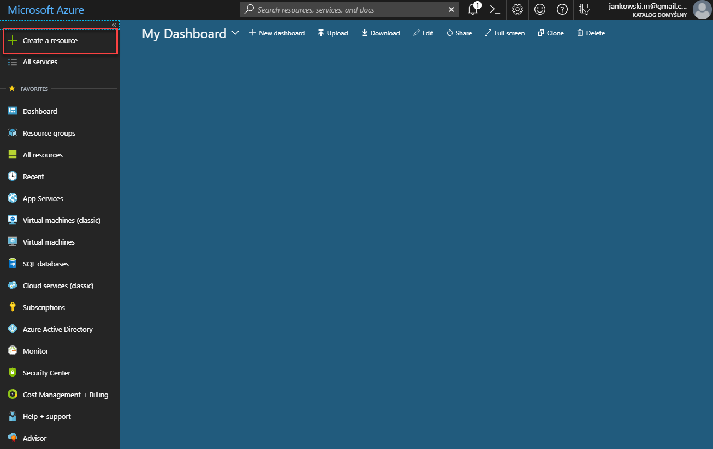
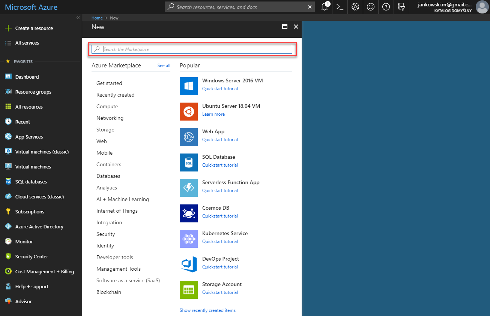
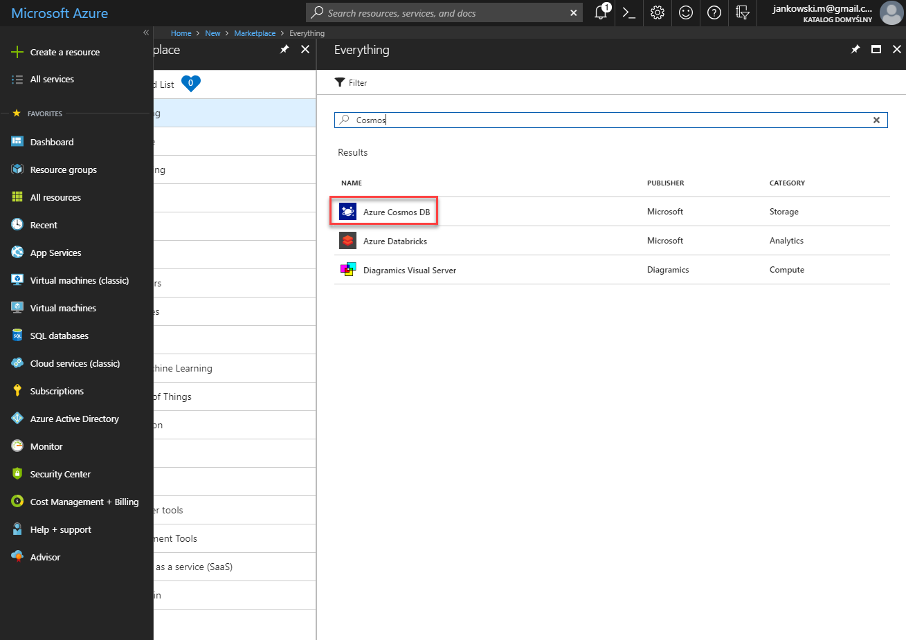
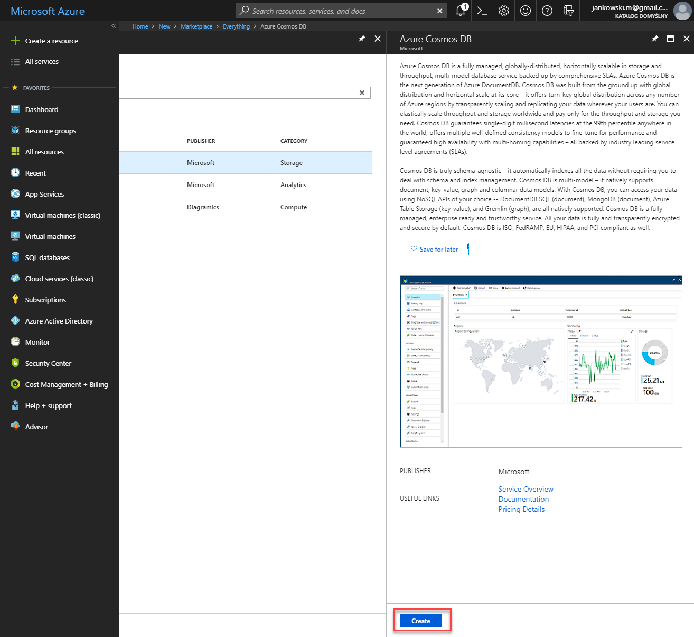
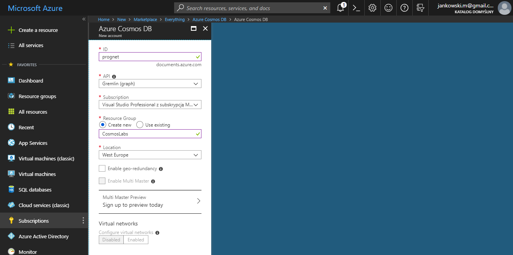
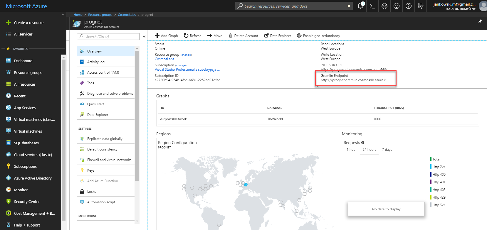
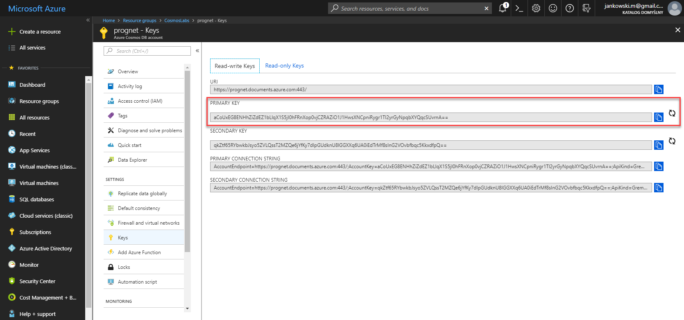

### Create Azure Cosmos DB Graph Database

1. In a new window, sign in to the **Azure Portal** (<http://portal.azure.com>).

1. On the left side of the portal, click the **Create a resource** link.

    

1. At the top of the **New** blade, locate the **Search the Marketplace** field.

    

1. Enter the text **Cosmos** into the search field and press **Enter**.

1. In the **Everything** search results blade, select the **Azure Cosmos DB** result.

    

1. In the **Azure Cosmos DB** blade, click the **Create** button.

    

1. In the new **Azure Cosmos DB** blade, perform the following actions:

    1. In the **ID** field, enter a globally unique value.

    1. In the **API** list, select the **Gremlin (graph)** option.

    1. Leave the **Subscription** field set to its default value.

    1. In the **Resource group** section, select the **Create new** option.

    1. In the **Resource group** section, enter the value **CosmosLabs**  into the empty field.

    1. In the **Location** field, select the **West Europe** location.

    1. Ensure the **Enable geo-redundancy** option is not selected.

        > This option creates a replicated version of your database in a second (paired) region.

    1. Ensure the **Enable Multi Master** option is not selected.

        > With Azure Cosmos DB multi-master support, you can perform writes on containers of data (for example, collections, graphs, tables) distributed anywhere in the world. You can update data in any region that is associated with your database account. These data updates can propagate asynchronously. 

    1. In the **Virtual networks** section, select the **Disabled** option.

        > Azure CosmosDB accounts can be configured to allow access only from specific subnet of an Azure Virtual Network. By enabling a Service Endpoint for Azure CosmosDB from a Virtual Network and its subnet, traffic is ensured an optimal and secure route to the Azure Cosmos DB.

    1. Click the **Create** button.

    

    1. Wait for database creation

1. In the **Resource groups** blade, locate and select the **CosmosLabs** *Resource Group*.

1. In the **CosmosLabs** blade, select the **Azure Cosmos DB** account you recently created.

1. In the **Azure Cosmos DB** blade, locate and click the **Overview** link on the left side of the blade.

1. At the top of the **Azure Cosmos DB** blade, click the **Add Graph** button.

1. In the **Add Graph** popup, perform the following actions:

    1. In the **Database id** field, select the **Create new** option and enter the value **TheWorld**.

    1. Ensure the **Provision database throughput** option is not selected.

    1. In the **Collection id** field, enter the value **AirportsNetwork**.

    1. In the **Storage capacity** section, select the **Fixed-Size** option.

    1. In the **Throughput** field, enter the value ``4000``.

    1. Click the **OK** button.

1. Wait for the creation of the **collection**.

### Clone / download git repository
`git clone https://github.com/MichalJankowskii/CosmosDB-Graph-Generator.git`

### Generate database

1. Open in Visual Studio **GraphCreator** solution. It is located in the _src_ folder.

1. Open **Program.cs** file and update value of _Hostname_ and _AuthKey_ variables.

1. To get _Hostname_:
    1.  On the left side of the **Azure Cosmos DB** blade, locate the **Settings** section and click the **Overview** link.

    1. Copy value of **Gremlin Endpoint**

    

1. To get _AuthKey_:
	1. On the left side of the **Azure Cosmos DB** blade, locate the **Settings** section and click the **Keys** link.

	1. Copy value of **PRIMARY KEY**

	
    
1. Compile and run the application. After a while your database will be created.